# Разработка правил

## Создание пакета экспертизы

Чтобы создать пакет экспертизы:

1. В панели **Панель действий** нажмите на значок .

2. В панели **Дерево объектов** нажмите правой кнопкой мыши на папку **packages**.

3. В открывшемся меню выберите **Создать** → **Новый пакет экспертизы**.

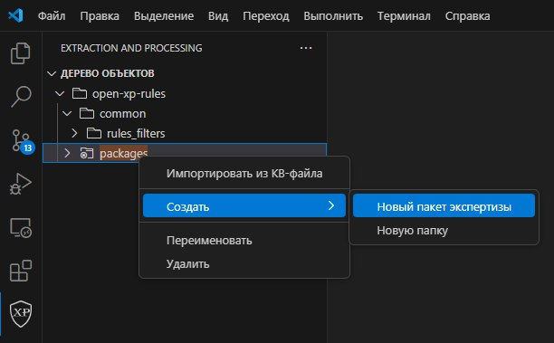

4. В верхней части экрана откроется окно для ввода названия пакета.

5. Введите название пакета и нажмите клавишу ENTER.

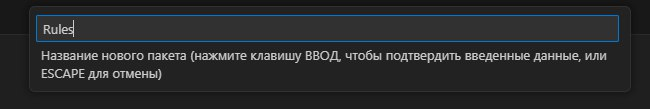

Пакет экспертизы создан.

## Создание правила корреляции

Чтобы создать правило корреляции:

1. В панели **Панель действий** нажмите на значок .

2. В панели **Дерево объектов** нажмите правой кнопкой мыши на папку, в которой вы хотите создать правило.

3. В открывшемся меню выберите **Создать** → **Новое правило корреляции**.

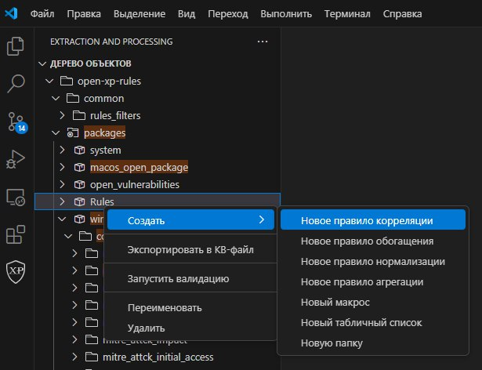

4. Откроется вкладка **Создать правило корреляции**.

5. В поле **Название** введите название правила корреляции.

6. Если требуется, в раскрывающемся списке **Шаблон** выберите шаблон для правила корреляции.

   При выборе шаблона правило создается с готовой структурой и заполненной информации о событии, на базе которого создан шаблон.

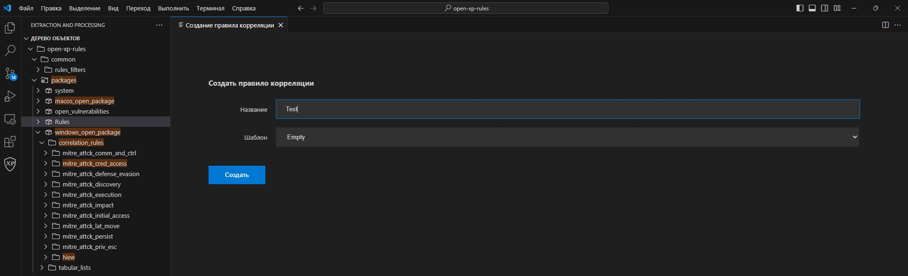

7. Нажмите кнопку **Создать**.

Правило корреляции создано.

## Создание правила обогащения

Чтобы создать правило обогащения:

1. В панели **Панель действий** нажмите на значок .

2. В панели **Дерево объектов** нажмите правой кнопкой мыши на папку, в которой вы хотите создать правило.

3. В открывшемся меню выберите **Создать** → **Новое правило обогащения**.

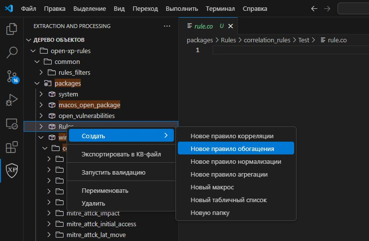

4. Откроется вкладка **Создать правило обогащения**.

5. В поле **Название** введите название правила обогащения.

6. Если требуется, в раскрывающемся списке **Шаблон** выберите для правила обогащения.

   При выборе шаблона правило создается с готовой структурой.

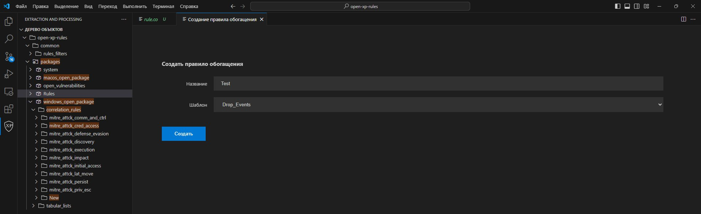

7. Нажмите кнопку **Создать**.

Правило обогащения создано.

## Редактирование правила

Чтобы отредактировать правило:

1. В панели **Панель действий** нажмите на значок .

2. В панели **Дерево объектов** выберите правило, которое вы хотите изменить.

   В редакторе отроется исходный код правила.

3. Внесите изменение в правило.

4. Сохраните изменения сочетанием клавиш **Ctrl + S** для ОС Windows или нажмите **Файл** → **Сохранить**.

## Изменение названия правила

Чтобы изменить название правила:

1. В панели **Панель действий** нажмите на значок .

2. В панели **Дерево объектов** нажмите правой кнопкой на правило, название которого вы хотите изменить.

3. В открывшемся меню выберите **Переименовать**.

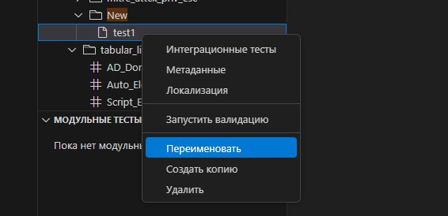

4. Откроется окно **Новое имя правила**.

5. Измените название правила и нажмите клавишу ENTER.

Название правила изменено. Название в исходном коде правила обновлено автоматически.

## Добавление информации о правиле

Вы можете добавить информацию о правиле в файл `metainfo.yaml`.

Чтобы добавить информацию о правиле:

1. В панели **Панель действий** нажмите на значок .

2. В панели **Дерево объектов** нажмите правой кнопкой мыши на правило, для которого вы хотите добавить информацию.

3. В открывшемся меня выберите **Метаданные**.

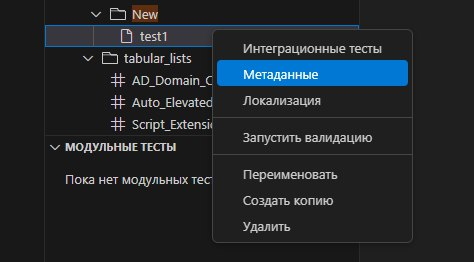

4. Откроется вкладка **Метаданные**.

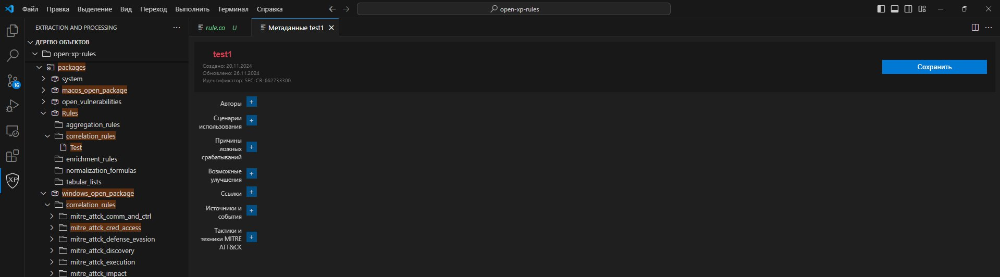

5. Заполните необходимые поля и нажмите кнопку **Сохранить**.

Информация о правиле добавлена.

## Настройка правил локализации

При регистрации нормализованного, агрегированного или корреляционного события в продукте с ним может быть связано описание на русском или английском языке (в зависимости от языка интерфейса). Сопоставление описаний с регистрируемыми событиями выполняется согласно заранее созданным правилам локализации. Для нормализованного события правила локализации создаются для правила нормализации, по которой выполняется нормализация этого события, для агрегированного или корреляционного события — для правила агрегации или корреляции, по которому регистрируется событие.

Для одного события может быть создано несколько правил локализации, в зависимости от указанного критерия. Например, вы можете создать, одно правило локализации для события выхода из системы и два правила локализации для события входа в систему, указав в качестве критерия результат входа — успешный или неуспешный.

Чтобы настроить правила локализации:

1. В панели **Панель действий** нажмите на значок .

2. В панели **Дерево объектов** нажмите правой кнопкой мыши на правило, для которого вы хотите настроить правила локализации.

3. В открывшемся меню выберите **Локализации**.

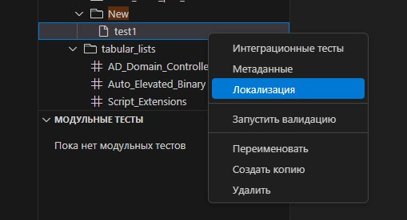

4. Откроется вкладка **Локализации**.

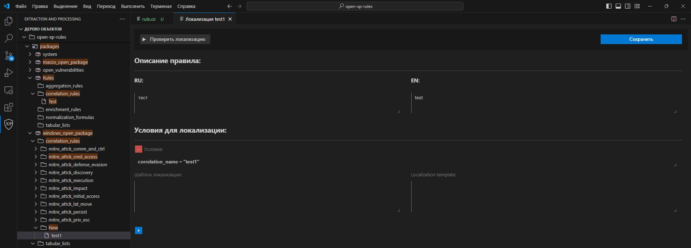

5. Если требуется, введите описание правила на русском и английском языках.

6. В разделе **Условия для локализации** в полях **Шаблон локализации** и **Localization template** введите описание события на русском и английском языках.

7. При необходимости добавьте и настройте другие правила локализации с помощью кнопки **+**.

8. Нажмите кнопку **Сохранить**.

Правила локализации настроены.