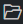

# Разработка правил

## Создание пакета экспертизы

Чтобы создать пакет экспертизы:

1. В панели **Action Bar** нажмите на значок .

1. В панели **Дерево контента** нажмите правой кнопкой мыши на корневой объект со значком .

1. В открывшемся меню выберите **Создать пустой пакет**.

   В верхней части экрана откроется окно для ввода названия пакета.

1. Введите название пакета и нажмите клавишу ENTER.

Пакет экспертизы создан.

## Создание правила корреляции

Чтобы создать правило корреляции:

1. В панели **Action Bar** нажмите на значок .

1. В панели **Дерево контента** нажмите правой кнопкой мыши на папку, в которой вы хотите создать правило.

1. В открывшемся меню выберите **Создать корреляцию**.

   Откроется вкладка **Создание правила корреляции**.

1. В поле **Название корреляции** введите название правила корреляции.

1. Если требуется, в раскрывающемся списке **Шаблон** выберите шаблон для правила корреляции.

   При выборе шаблона правило создается с готовой структурой и заполненной информации о событии, на базе которого создан шаблон.

1. Нажмите кнопку **Создать**.

Правило корреляции создано.

## Создание правила обогащения

Чтобы создать правило обогащения:

1. В панели **Action Bar** нажмите на значок .

1. В панели **Дерево контента** нажмите правой кнопкой мыши на папку, в которой вы хотите создать правило.

1. В открывшемся меню выберите **Создать обогащение**.

   Откроется вкладка **Создание правила обогащения**.

1. В поле **Название обогащения** введите название правила обогащения.

1. Если требуется, в раскрывающемся списке **Шаблон** выберите для правила обогащения.

   При выборе шаблона правило создается с готовой структурой.

1. Нажмите кнопку **Создать**.

Правило обогащения создано.

## Редактирование правила

Чтобы отредактировать правило:

1. В панели **Action Bar** нажмите на значок .

1. В панели **Дерево контента** выберите правило, которое вы хотите изменить.

   В редакторе отроется исходный код правила.

1. Внесите изменение в правило.

1. Сохраните изменения.

## Изменение названия правила

Чтобы изменить название правила:

1. В панели **Action Bar** нажмите на значок .

1. В панели **Дерево контента** нажмите правой кнопкой на правило, название которого вы хотите изменить.

1. В открывшемся меню выберите **Переименовать**.

   Откроется окно **Новое имя правила**.

1. Измените название правила и нажмите клавишу ENTER.

Название правила изменено. Название в исходном коде правила обновлено автоматически.

## Добавление информации о правиле

Вы можете добавить информацию о правиле в файл `metainfo.yaml`.

Чтобы добавить информацию о правиле:

1. В панели **Action Bar** нажмите на значок .

1. В панели **Дерево контента** нажмите правой кнопкой мыши на правило, для которого вы хотите добавить информацию.

1. В открывшемся меня выберите **Метаданные**.

   Откроется вкладка **Метаданные**.

1. Заполните необходимые поля.

Информация о правиле добавлена.

## Настройка правил локализации

При регистрации нормализованного, агрегированного или корреляционного события в продукте с ним может быть связано описание на русском или английском языке (в зависимости от языка интерфейса). Сопоставление описаний с регистрируемыми событиями выполняется согласно заранее созданным правилам локализации. Для нормализованного события правила локализации создаются для правила нормализации, по которой выполняется нормализация этого события, для агрегированного или корреляционного события — для правила агрегации или корреляции, по которому регистрируется событие.

Для одного события может быть создано несколько правил локализации, в зависимости от указанного критерия. Например, вы можете создать, одно правило локализации для события выхода из системы и два правила локализации для события входа в систему, указав в качестве критерия результат входа — успешный или неуспешный.

Чтобы настроить правила локализации:

1. В панели **Action Bar** нажмите на значок .

1. В панели **Дерево контента** нажмите правой кнопкой мыши на правило, для которого вы хотите настроить правила локализации.

1. В открывшемся меню выберите **Локализации**.

   Откроется вкладка **Локализации**.

1. Если требуется, введите описание правила на русском и английском языках.

1. В поле **Критерий** введите условие применения правила локализации.

1. В полях **Локализация** и **Localization** введите описание события на русском и английском языках.

1. При необходимости добавьте и настройте другие правила локализации с помощью кнопки **+**.

1. Нажмите кнопку **Сохранить**.

Правила локализации настроены.