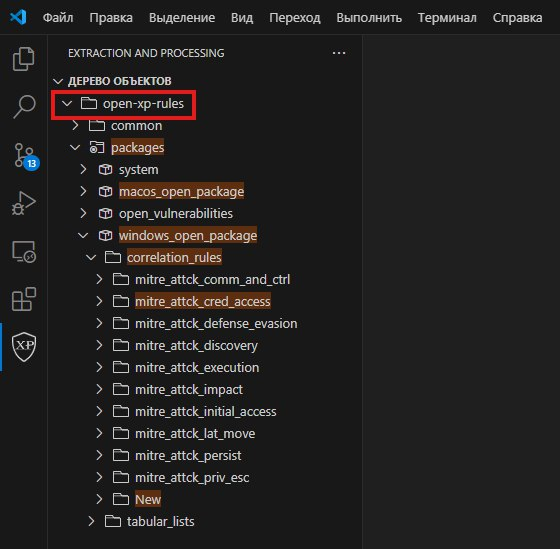

# Начало работы

## Основные возможности

Возможности расширения:
* Просмотр и редактирование правил нормализации, агрегации, корреляции, обогащения и табличных списков.
* Создание из шаблонов правил корреляции, обогащения и нормализации.
* Просмотр, редактирование, создание интеграционных и модульных тестов для правил корреляции, обогащения и нормализации.
* Запуск интеграционных и модульных тестов для правил корреляции, обогащения и нормализации.
* Автоматическое дополнение ключевых слов, функций и типовых конструкций языка XP и полей таксономии.
* Статическая валидация исходного кода на типичные ошибки.
* Заполнение метаданных правил.
* Создание и редактирование правил локализации правил.
* Сбор графов правил, схемы и БД табличных списков.
* Проверка срабатываний всего графа корреляций на необработанные события.
* Распаковка и упаковка пакетов экспертизы в файлы формата KB.

***Примечание.** Для этих операций расширение использует дополнительные утилиты, которые доступны в [отдельном репозитории](https://github.com/vxcontrol/xp-kbt/releases).

## Использование проекта VSCode XP Workspace
Вы можете легко получить готовое окружение для разработки на XP, если воспользуетесь проектом [VSCode XP Workspace](https://github.com/Security-Experts-Community/vscode-xp-workspace). В нём всё собрано в единый Docker-контейнер, а редактирование происходит через веб-версию VSCode.
Подробности в репозитории проекта.

## Требования

Вы можете использовать расширение в Visual Studio Code (версия 1.75.0 или выше) и в VSCodium.

Для корректной работы расширения в операционной системе скачайте и установите следующие компоненты:
1. [Git](https://git-scm.com) версии 2.30 или выше;
2. [.NET Runtime](https://dotnet.microsoft.com/en-us/download/dotnet/6.0) версии 6.0.

## Установка расширения

Чтобы установить расширение:

1. Откройте панель **Расширения** (в ОС Windows нажмите сочетание клавиш Ctrl+Shift+X).

2. В строке поиска введите **xplang**.

3. В результатах поиска откройте расширение **eXtraction and Processing**.

4. Нажмите **Установить**. Установка может занять несколько минут.

Расширение установлено. В панели **Панель действий** появился значок .

## Настройка расширения

Чтобы настроить расширение:

1. Скачайте набор утилит **XP Knowledge Base Toolkit** из [отдельного репозитория](https://github.com/vxcontrol/xp-kbt/releases) и разархивируйте архив в локальную папку.

2. Перейдите в редактор настроек:

   * В Windows/Linux выберите **Файл** → **Настройки** → **Параметры**.

   * В macOS выберите **Code** → **Параметры** → **Параметры**.

   или нажмите на шестиренку расширения **eXtraction and Processing** → **Параметры**.

3. Раскройте список **Расширения** и выберите **xp**.

1. В поле **Kbt Base Directory** введите путь к локальной папке с утилитами из п.4.

5. В поле **Output Directory Path** введите путь к папке для собранных графов.

   ***Примечание.** Изменять значение других параметров расширения не рекомендуется.*

## Выбор продукта

С помощью расширения вы можете разрабатывать экспертизу для MaxPatrol SIEM, MP EDR и SOLDR. Перед началом работы с экспертизой вам нужно выбрать продукт, в который она будет поставляться.

   ***Примечание.** Значение по умолчанию **SIEM**.*

Чтобы выбрать продукт:

1. В панели **Панель действий** нажмите на значок .

2. В левом нижнем углу экрана нажмите **SIEM**.

   В верхней части экрана откроется окно выбора продукта.

3. Выполните одно из следующих действий:

   * Если вы работаете с MaxPatrol SIEM, выберите **SIEM**.

   * Если вы работаете с MP EDR или SOLDR, выберите **EDR**.

## Открытие базы знаний

Для начала работы с правилами вам нужно открыть базу знаний. Если у вас нет базы знаний и вы хотите создать ее с нуля, вам нужно выбрать папку, в которой она будет размещена.

Чтобы открыть базу знаний:

1. В панели **Панель действий** нажмите на значок .

2. В панели **Дерево объектов** нажмите кнопку **Открыть базу знаний**.

3. Выберите папку.

4. Если содержимое папки не соответствует формату выбранного продукта, создайте в ней необходимые папки, нажав **Создать** во всплывающем окне в правом нижнем углу экрана.

5. В панели **Дерево объектов** нажмите .

   В панели отобразится содержимое выбранной папки. 

## Импорт пакета экспертизы из файла формата KB

Вы можете импортировать в рабочую папку пакеты экспертизы из файла формата KB.

Чтобы импортировать пакеты экспертизы:

1. Скачайте пакет экспертизы из [репозитория](https://github.com/Security-Experts-Community/open-xp-rules) и разархивируйте архив в локальную папку.

2. В панели **Панель действий** нажмите на значок .

3. В панели **Дерево объектов** нажмите кнопку **Открыть базу знаний**.

4. Выберите локальную папку из п.1 и нажмите **Выбор папки**.

5. Пакет экспертизы импортирован успешно.

## Создание и удаление папки

Вы можете создавать и удалять папки в вашей рабочей папке.

Чтобы создать папку:

1. В панели **Панель действий** нажмите на значок .

2. В панели **Дерево объектов** нажмите правой кнопкой мыши на папку, в которой вы хотите создать новую папку.

3. В открывшемся меню выберите **Создать** → **Новую папку**.

4. Введите имя папки и нажмите клавишу ENTER.

Папка создана.

Чтобы удалить папку:

1. В панели **Панель действий** нажмите на значок .

2. В панели **Дерево объектов** нажмите правой кнопкой мыши на папку, которую вы хотите удалить.

3. В открывшемся меню выберите **Удалить**.

Папка удалена.

## Обновление дерева объектов

Если файлы или папки из вашей базы знаний были изменены не в VSCode, то вам необходимо обновить **Дерево объектов**.

Чтобы обновить **Дерево объектов**:

1. В панели **Панель действий** нажмите на значок .

2. В панели **Дерево объектов** нажмите .

**Дерево объектов** обновлено.
