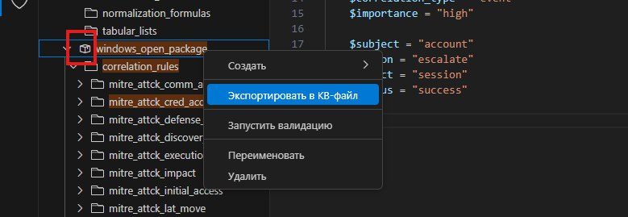

# Компиляция экспертизы для загрузки в продукты

## Обновление экспертизы в модулях коррелятора для EDR-решений

Чтобы обновить экспертизу в модулях коррелятора:

1. В панели **Панель действий** нажмите на значок .

2. В главном меню в разделе **Терминал** выберите пункт **Запустить задачу сборки** или нажмите сочетание клавиш **Ctrl+Shift+B**.

3. В открывшемся окне выберите команду **XP: Pack EDR content**.

   Откроется окно для выбора папки с модулем «packages».

4. Выберите папку с модулем «linux_open_package\correlation_rules» и нажмите кнопку **Сохранить**.

5. Откроется окно для выбора папки с модулем «packages».

5. Выберите папку с модулем «windows_open_package\correlation_rules» и нажмите кнопку **Сохранить**.

Экспертиза в модулях обновлена.

## Создание пакета экспертизы для SIEM-решений

Для переноса вашего набора правил в MaxPatrol SIEM вам нужно собрать их в файл формата KB.

Чтобы собрать пакет экспертизы:

1. В панели **Панель действий** нажмите на значок .

2. В панели **Дерево объектов** нажмите правой кнопкой мыши на объект со значком .

3. В открывшемся меню выберите **Экспортировать в KB-файл**.

   Откроется окно **Сохранение**.

4. Выберите папку, в которую вы хотите сохранить файл, и введите имя файла.

5. Нажмите кнопку **Сохранить**.

Экспертиза опубликована. Далее вам нужно импортировать файл в MaxPatrol SIEM.
