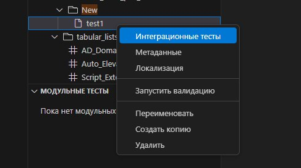
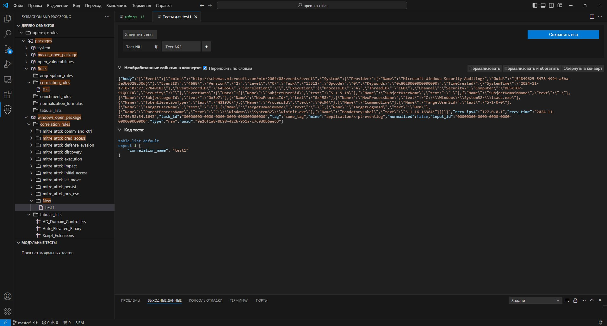
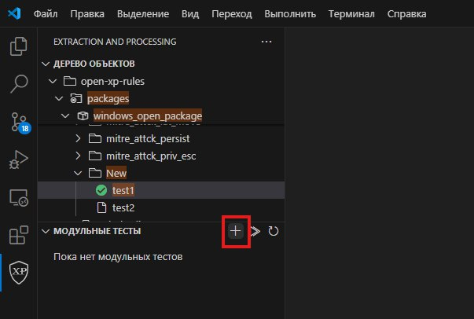
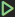
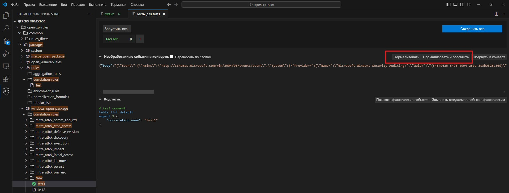
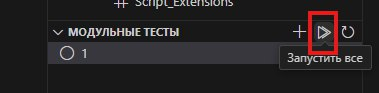
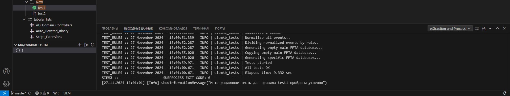
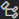
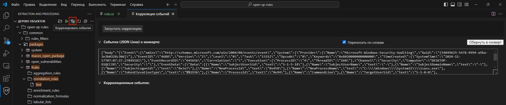

# Тестирование правил

## Создание интеграционного теста

Интеграционные тесты нужны для отладки правил нормализации, корреляции и обогащения на необработанных событиях.

Чтобы создать интеграционный тест:

1. В панели **Панель действий** нажмите на значок .

1. В панели **Дерево объектов** нажмите правой кнопкой мыши на правило, для которого вы хотите создать интеграционный тест.

1. В открывшемся меню выберите **Интеграционные тесты**.

   Откроется вкладка **Тесты для "Название правила"**.

1. Нажмите **+** для создания теста или кнопку **Корзина** для удаления теста.

1. В поле **Необработанные события в конверте** вставьте одно или несколько необработанных событий. При необходимости, отметьте чек-бокс **Переносить по словам**.

1. Нажмите кнопку **Обернуть в конверт** и выберите MIME-тип необработанного события.

1. Поле **Код теста** предзаполнено тестовым сценарием. При необходимости, отредактируйте его.

1. Нажмите кнопку **Сохранить все**.

Интеграционный тест создан.

## Создание модульного теста

Модульные тесты нужны для отладки правил корреляции и обогащения на нормализованных событиях.

Чтобы создать модульный тест:

1. В панели **Панель действий** нажмите на значок .

1. В панели **Дерево объектов** выберите **Модульные тесты** и нажмите **+**.

1. В редакторе введите тестовый сценарий. ри необходимости, отметьте чек-бокс **Переносить по словам**.
 
   ***Примечание.** Тестовый сценарий должен содержать хотя бы одно нормализованное событие и ожидаемый результат.*

1. Сохраните изменения.

Модульный тест создан.

## Сбор графов

Для запуска модульных тестов вам нужно собрать все графы.

Чтобы собрать графы:

1. В панели **Панель действий** нажмите на значок .

1. В панели **Дерево объектов** нажмите кнопку **Компилировать все правила и списки** .

   Запустится сбор графов. В панели **Output** будет выведен результат.

## Проверка правил нормализации

Вы можете проверить работу правил нормализации на необработанных событиях. Перед началом проверки вам нужно создать [интеграционный тест](help/ru-RU/testing#4516961931).

Чтобы проверить правила нормализации:

1. В панели **Панель действий** нажмите на значок .

1. В панели **Дерево объектов** нажмите правой кнопкой мыши на правило, для которого создан интеграционный тест.

1. В открывшемся меню выберите **Интеграционные тесты**.

   Откроется вкладка **Тесты для "Название правила"**.

1. Выберите необходимый тест.

1. Выполните одно из следующих действий:

   * Если вы хотите только нормализовать необработанные события, нажмите кнопку **Нормализовать**.

   * Если вы хотите нормализовать и обогатить необработанные события, нажмите кнопку **Нормализовать + обогатить**.

   Запустится процесс нормализации. При успешном завершении отобразится нормализованное событие.

1. Если вы хотите запустить модульный тест по сформированному нормализованному событию, нажмите кнопку **Быстрый тест**.

## Запуск интеграционных тестов одного правила

Чтобы запустить все интеграционные тесты одного правила:

1. В панели **Панель действий** нажмите на значок .

1. В панели **Дерево объектов** нажмите правой кнопкой мыши на правило, для которого вы хотите запустить интеграционный тест.

1. В открывшемся меню выберите **Интеграционные тесты**.

   Откроется вкладка **Тесты для "Название правила"**.

1. Нажмите кнопку **Запустить все**.

   Последовательно будут запущены все добавленные интеграционные тесты. Если тест пройдет успешно, то напротив него появится значок , если не успешно — . В панели **Выходные данные** отобразятся подробные результаты их выполнения.

## Запуск всех модульных тестов одного правила

Чтобы запустить все модульные тесты одного правила:

1. В панели **Панель действий** нажмите на значок .

1. В панели **Дерево объектов** выберите **Модульные тесты** и нажмите .

   Последовательно будут запущены все добавленные модульные тесты. Если тест пройдет успешно, то напротив него появится значок , если не успешно — . В панели **Output** отобразятся подробные результаты тестов.

## Корреляция необработанных событий

Для проверки правил вы можете пропустить через весь граф корреляций необработанные события. Перед этим вам нужно [собрать графы](help/ru-RU/testing#4516964235).

Чтобы скоррелировать необработанные события:

1. В панели **Панель действий** нажмите на значок .

1. В панели **Дерево объектов** нажмите кнопку **Коррелировать события** .

   Откроется вкладка **Корреляция событий**.

1. В поле **События (JSON Lines) в конверте** вставьте одно или несколько необработанных событий, которые нужно пропустить через граф корреляций. При необходимости, отметьте чек-бокс **Переносить по словам**.

1. Нажмите кнопку **Обернуть в конверт** и выберите MIME-тип необработанного события.

1. Нажмите кнопку **Запустить корреляцию**.

   Запустится процесс корреляции. В блоке **Корреляционные события** будут выведены скоррелированные события.
