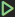
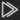
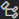

# Тестирование правил

## Создание интеграционного теста

Интеграционные тесты нужны для отладки правил нормализации, корреляции и обогащения на необработанных событиях.

Чтобы создать интеграционный тест:

1. В панели **Action Bar** нажмите на значок .

1. В панели **Дерево контента** нажмите правой кнопкой мыши на правило, для которого вы хотите создать интеграционный тест.

1. В открывшемся меню выберите **Тесты**.

   Откроется вкладка **Тесты**.

1. Нажмите **+**.

1. В поле **Сырое событие** вставьте одно или несколько необработанных событий.

1. Нажмите кнопку **Конверт** и выберите MIME-тип необработанного события.

1. В поле **Код теста** введите тестовый сценарий.

1. Нажмите кнопку **Сохранить все**.

Интеграционный тест создан.

## Создание модульного теста

Модульные тесты нужны для отладки правил корреляции и обогащения на нормализованных событиях.

Чтобы создать модульный тест:

1. В панели **Action Bar** нажмите на значок .

1. В панели **Дерево контента** выберите правило, для которого вы хотите создать модульный тест.

1. В панели **Модульные тесты** нажмите **+**.

1. В редакторе введите тестовый сценарий.

   Тестовый сценарий должен содержать хотя бы одно нормализованное событие и ожидаемый результат.

1. Сохраните изменения.

Модульный тест создан.

## Сбор графов

Для запуска модульных тестов вам нужно собрать все графы.

Чтобы собрать графы:

1. В панели **Action Bar** нажмите на значок .

1. В панели **Дерево контента** нажмите .

   Запустится сбор графов. В панели **Output** будет выведен результат.

## Проверка правил нормализации

Вы можете проверить работу правил нормализации на необработанных событиях. Перед началом проверки вам нужно создать [интеграционный тест](help/ru-RU/testing#4516961931).

Чтобы проверить правила нормализации:

1. В панели **Action Bar** нажмите на значок .

1. В панели **Дерево контента** нажмите правой кнопкой мыши на правило, для которого создан интеграционный тест.

1. В открывшемся меню выберите **Тесты**.

   Откроется вкладка **Тесты**.

1. Выберите необходимый тест.

1. Выполните одно из следующих действий:

   * Если вы хотите только нормализовать необработанные события, нажмите кнопку **Нормализовать**.

   * Если вы хотите нормализовать и обогатить необработанные события, нажмите кнопку **Нормализовать + Обогатить**.

   Запустится процесс нормализации. При успешном завершении отобразится нормализованное событие.

1. Если вы хотите запустить модульный тест по сформированному нормализованному событию, нажмите кнопку **Быстрый тест**.

## Запуск интеграционного теста

Чтобы запустить интеграционный тест:

1. В панели **Action Bar** нажмите на значок .

1. В панели **Дерево контента** нажмите правой кнопкой мыши на правило, для которого вы хотите запустить интеграционный тест.

1. В открывшемся меню выберите **Тесты**.

   Откроется вкладка **Тесты**.

1. Нажмите кнопку **Запустить все тесты**.

   Последовательно будут запущены все добавленные интеграционные тесты. В панели **Output** отобразятся подробные результаты их выполнения.

## Запуск модульного теста

Чтобы запустить модульный тест:

1. В панели **Action Bar** нажмите на значок .

1. В панели **Дерево контента** выберите правило, для которого вы хотите запустить модульный тест.

1. В панели **Модульные тесты** нажмите .

   Последовательно будут запущены все добавленные модульные тесты. Если тест пройдет успешно, то напротив него появится значок , если не успешно — . В панели **Output** отобразятся подробные результаты тестов.

## Корреляция необработанных событий

Для проверки правил вы можете пропустить через весь граф корреляций необработанные события. Перед этим вам нужно [собрать графы](help/ru-RU/testing#4516964235).

Чтобы скоррелировать необработанные события:

1. В панели **Action Bar** нажмите на значок .

1. В панели **Дерево контента** нажмите .

   Откроется вкладка **Скоррелировать события**.

1. В поле **Сырое событие** вставьте одно или несколько необработанных событий, которые нужно пропустить через граф корреляций.

1. Нажмите кнопку **Конверт** и выберите MIME-тип необработанного события.

1. Нажмите кнопку **Скоррелировать события**.

   Запустится процесс корреляции. В блоке **Скоррелированные события** будут выведены скоррелированные события.
